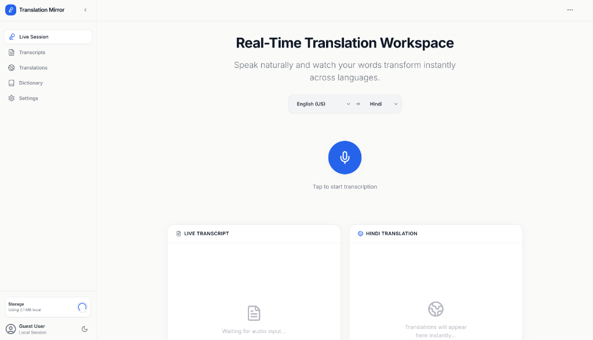
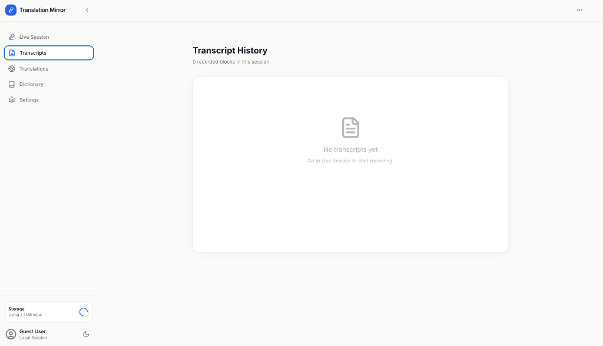
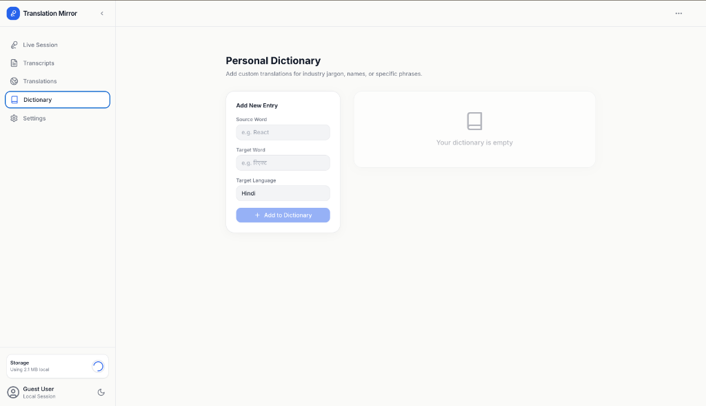

#  Translation Mirror Project

[](https://translation-mirror.netlify.app/)


A production-ready, frontend-only speech recognition and real-time translation platform built with React, Vite, and TypeScript. 

No backend. No cloud API keys. Everything runs locally in the browser utilizing the native Web Speech API.

---

##  Screenshots





---

##  Features

| Feature | Description |
|---------|-------------|
|  **Web Speech API** | Continuous/interim speech recognition directly in-browser. |
|  **Client-side Translation** | Built-in 200+ word dictionary (EN → HI/FR/ES/DE). |
|  **Confidence Tracker** | Green/Yellow/Red confidence bands with a live sparkline graph. |
|  **Telemetry HUD** | 8 animated real-time metric cards for speech statistics. |
|  **Split-screen Mirror** | Live transcription + translated mirror side-by-side. |
|  **LocalStorage Persistence** | Auto-saves transcripts, translations, and user preferences. |
|  **Export System** | Download transcripts as `.md`, `.txt`, or `.json`. |
|  **Glassmorphism UI** | Premium Dark/Light mode SaaS-like design. |
|  **Custom Dictionary** | Add your own custom word translations on the fly. |
|  **History Search** | Filter past sessions by date, word, or language. |
|  **Session Analytics** | Word frequency, average confidence, and session duration. |

---

## Setup Instructions

Follow these steps to run the project locally. Any developer should be able to get this running in minutes.

### Prerequisites
- Node.js (v16+ recommended)
- npm or yarn

### Installation

1. **Clone the repository:**
   ```bash
   git clone https://github.com/harsh4421/Translation-Mirror-Project.git
   cd Translation-Mirror-Project
   ```

2. **Install dependencies:**
   ```bash
   npm install
   ```

3. **Start the development server:**
   ```bash
   npm run dev
   ```

4. **Live Demo:**
   Open https://translation-mirror.netlify.app/ in **Chrome** or **Edge**. 
   *(Note: The Web Speech API is not fully supported in Firefox or Safari).*

### Build for Production
To create a production build:
```bash
npm run build
```
This will generate a `dist` folder containing the compiled static assets ready for deployment to any static hosting provider (Vercel, Netlify, GitHub Pages, etc.).

---

##  Tech Stack

- **Framework:** React 18
- **Build Tool:** Vite 5
- **Language:** TypeScript 5
- **State Management:** Zustand 4 (with `subscribeWithSelector` middleware)
- **Styling:** Tailwind CSS 3
- **Animations:** Framer Motion 11
- **Icons:** Lucide React
- **Core API:** Native Web Speech API
- **Utilities:** FileSaver.js (for file exports)

---

##  Supported Languages

### Speech Recognition (Source)
- 🇺🇸 English (en-US)
- 🇮🇳 Hindi (hi-IN)
- 🇫🇷 French (fr-FR)
- 🇪🇸 Spanish (es-ES)
- 🇩🇪 German (de-DE)

### Translation (Target)
- 🇬🇧 English
- 🇮🇳 Hindi
- 🇫🇷 French
- 🇪🇸 Spanish
- 🇩🇪 German

---

##  Adding New Languages

1. Add a new `TargetLanguage` type in `src/types/index.ts`.
2. Add entries in `src/services/dictionaryService.ts` using the new language key.
3. Add the language option to the `TARGET_LANGUAGES` array in `src/types/index.ts`.

---

##  Browser Requirements

- **Chrome** 33+ or **Edge** 79+ (Required for Web Speech API).
- **Microphone permission** must be granted when prompted.
- **HTTPS** is required in production (HTTP works on localhost).

---

##  Keyboard Shortcuts

| Key | Action |
|-----|--------|
| `Space` | Toggle Start/Stop Listening |

---

## 🗂️ Project Structure

```text
src/
├── components/
│   ├── speech/          # Speech recognition components
│   ├── translation/     # Translation output components
│   ├── telemetry/       # Metrics dashboard & UI animations
│   ├── views/           # Full app views (Dashboard, Settings, etc.)
│   └── common/          # Reusable UI elements (Buttons, Notifications)
├── hooks/               # Custom React hooks (useSpeechRecognition, useTranslation)
├── layouts/             # App shell layouts
├── pages/               # Main page containers
├── services/            # Core business logic (Dictionary, Export, Storage)
├── store/               # Zustand global state definitions
├── types/               # TypeScript interfaces & enums
└── utils/               # Helper functions (Tokenizer, Confidence analyzer)
```
